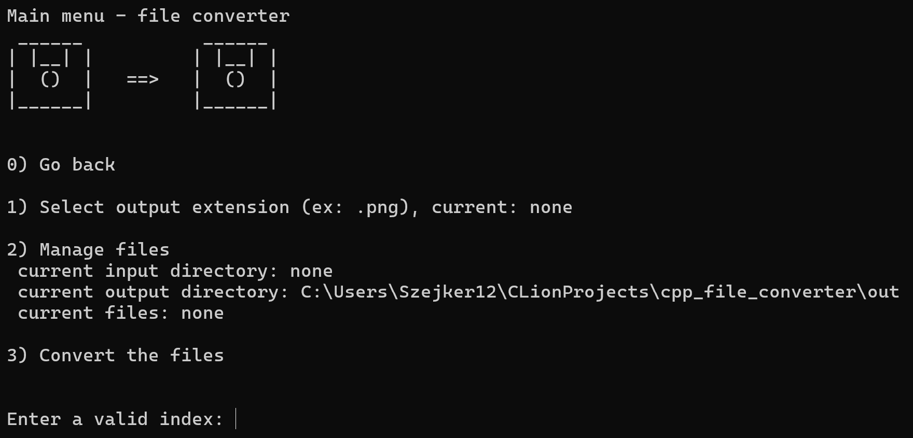

# cpp_file_converter ⚙️
A simple file converter program \
(An extra project for "pp2")

---
## Overview 🗺️



---

## Quick setup (Windows): 💻

1) Go to: https://github.com/opencv/opencv/releases
2) Download the opencv-X.X.X-windows.exe (tested on 5.0.0)
3) Run the exe file (extract to C:\opencv for example)
4) Type in windows search bar: 
   - EN: "Edit the system environment variables"
   - PL: "Edytuj zmienne środowiskowe systemu"
5) Environment variables → System Variables → Path → Edit → New
6) Paste the path of the bin folder (C:\opencv\opencv\build\x64\vc16\bin - if extracted to C:\opencv)
7) Restart PC / IDE

---

## Quick setup (Linux): 🐧

```bash
# install OpenCV
sudo apt-get install libopencv-dev
```

---

## Quick setup (MacOs):  🍎

```bash
# install OpenCV
brew install opencv
```

---

### Clion integration: 🦁
1) Ensure "File | Settings | Build, Execution, Deployment | Toolchains" is set to Visual Studio
2) Example CmakeLists.txt:

```cmake
cmake_minimum_required(VERSION 3.25)
project(file_converter)

set(CMAKE_CXX_STANDARD 20)

# 1. tell CMake where to find the OpenCV configuration files
set(OpenCV_DIR "C:/opencv/opencv/build")

# 2. find the OpenCV package
find_package(OpenCV REQUIRED)

# 3. include the OpenCV headers
include_directories(${OpenCV_INCLUDE_DIRS})

# 4. add cpp files
add_executable(file_converter main.cpp file_converter.cpp)

# 5. link the OpenCV libraries to your executable
target_link_libraries(file_converter ${OpenCV_LIBS})
```
3) Include the library in project for example:
```c++
#include <opencv2/opencv.hpp>
```

---

## Usage 🚀
```bash
# for help
fileconverter -h

# open in menu mode (manually select files, provide extension etc)
fileconverter

# quickest way to convert files:
# fileconverter <output_format> <input_directory>
# this will read recursively through the dir structure and try to convert all files encountered
fileconverter .png /input/dir/path

# convert files: <output_format> <input_directory> <relative file paths>
fileconverter .png /input/dir/path  Image1 Image2 ...
```

---

## External libraries used 📦
- OpenCV (5.0.0 - at the time of creation)
- std::filesystem

---

### Project structure 📁

```text
file-converter
├── 🙈 .gitignore                 # Git ignore rules
├── 📐 CMakeLists.txt             # CMake build configuration
├── 🧱 file_converter.cpp         # Core implementation logic
├── 📑 file_converter.h           # Header declarations
├── 🚀 main.cpp                   # Application entry point
├── 📖 README.md                  # This file
├── 📁 cmake-build-debug/         # CMake debug build directory (Windows)
│   └── 🖥️ file_converter.exe     # Compiled Windows executable (Windows)
└── 📁 out/                       # Default output directory
```
